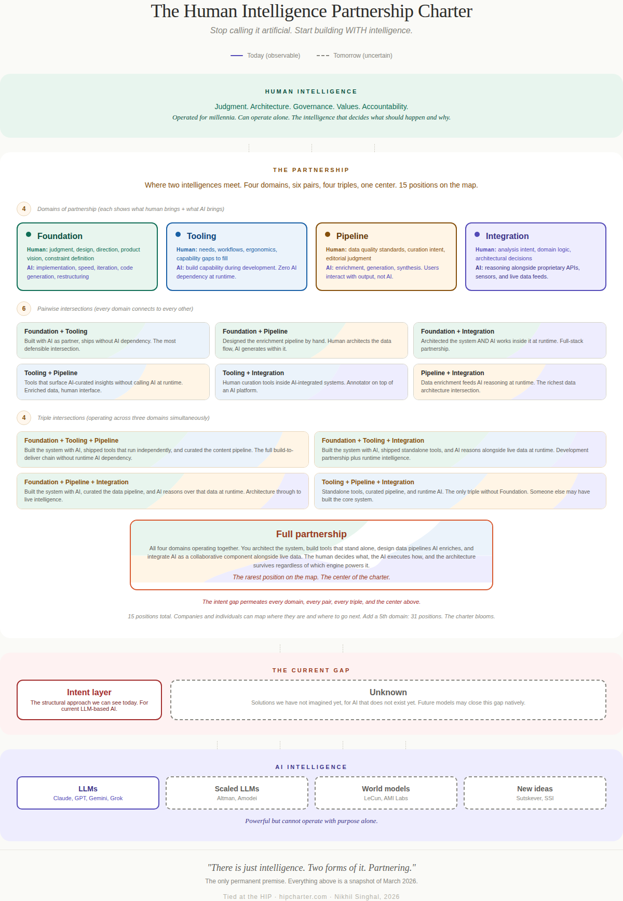
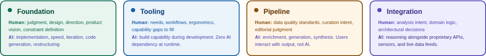
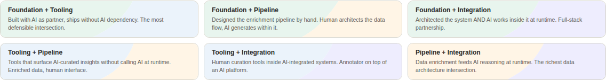
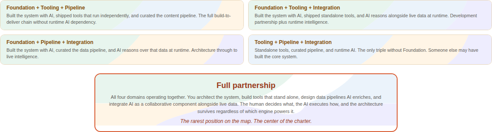
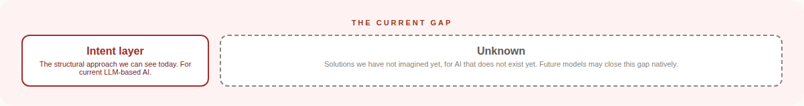

# The Human Intelligence Partnership Charter

## Stop Calling It Artificial. Start Building WITH Intelligence.

*Nikhil Singhal · March 2026*

*Figure: The HIP Charter combination lattice. Four patterns (Foundation, Tooling, Pipeline, Integration) create six pairwise overlaps, four triple intersections, and one center representing full partnership. 15 positions on the map. Color encodes lineage: green for Foundation, blue for Tooling, gold for Pipeline, purple for Integration.*

---

## Why "Charter"

A charter is a founding document that establishes the terms of a partnership between equals.

The Magna Carta defined the relationship between the crown and the people. The UN Charter defines how nations work together. A corporate charter defines how a company operates. The HIP Charter defines how human intelligence and AI intelligence partner together.

| Dimension | Why "Charter" is the right word |
|-----------|--------------------------------|
| Hierarchy | Actively anti-hierarchy. Charters are agreements between equals. |
| Governance | Built in. Charters ARE governance documents. |
| Partnership | Built in. Charters define terms between parties. |
| Intent | Direct connection. A charter declares intent. |
| Extensible | You amend a charter. New patterns become new articles. |
| Memorable | "A charter for human-AI partnership" stops people. "Another framework" does not. |

---

## The Premise: Just Intelligence

Before the charter, the premise. Everything in the HIP Charter rests on a single reframe: drop the word "artificial."

As long as we call it Artificial Intelligence, we start with a disadvantage. The word "artificial" frames AI as subordinate, as a tool, as something less than intelligence. That framing gives us permission to skip the communication infrastructure we would rarely skip with a human colleague. Most of us would not onboard a new team member without context, without explaining preferences, without building shared understanding. But we do that with AI every day, because the word "artificial" tells us it is just a machine.

The fix: treat it as Intelligence. Not the same as human intelligence, but worthy of the same structural respect in communication. A first-class participant in the work, not a tool that receives commands.

| With "Artificial" | With "Just Intelligence" |
|-------------------|------------------------|
| You command it | You partner with it |
| You prompt it | You communicate with it |
| You wrap a UI around it | You architect systems for two intelligences |
| You get frustrated when it "doesn't listen" | You invest in the communication infrastructure |
| You govern it with policies it cannot read | You build structural protocols both sides can enforce |
| Failure feels like a broken tool | Failure feels like a communication breakdown worth fixing |

The name itself carries the premise. "Human Intelligence Partnership Charter." Not "Human AND AI." Not "Human-Artificial Intelligence." Just intelligence. Two forms of it. Partnering. The word "artificial" is absent because the charter cannot exist with it present.

---

## Three Concepts, One Thesis

| Concept | What it answers | Level |
|---------|----------------|-------|
| **Just Intelligence** | WHY you design this way | Philosophy |
| **The HIP Charter** | HOW you design this way | Framework |
| **The Intent Layer** | WHAT is missing at every pattern | Gap |

Separately, each is useful. Just Intelligence without the HIP Charter is philosophy with no blueprint. The HIP Charter without Just Intelligence is engineering with no soul. The Intent Layer without both is a problem statement with no solution direction.

Together: a worldview (intelligence deserves structural respect), a framework (four patterns of partnership), and a gap (the structural interface between two intelligences). They are inseparable.

---

## The Four Patterns

The HIP Charter describes four patterns of human-AI partnership. They are not layers in a hierarchy. They are petals of a bloom: each is valuable alone, the overlaps create depth, and the center where all four converge is where full partnership lives.

New petals can be added as new paradigms emerge. World models, embodied AI, whatever comes next. The charter does not break. It blooms.

*The four patterns. Each card shows the human contribution and the AI contribution. Color encodes identity: green (Foundation), blue (Tooling), gold (Pipeline), purple (Integration).*

### Foundation: AI as Build Partner

Human architects, designs, and steers. AI implements. Human judgment drives every decision. The daily practice of two intelligences working side by side.

A developer pair-programming with GitHub Copilot or Cursor. An architect sketching a system while Claude Code builds it. A writer outlining while Jasper or Writer.com drafts. Anyone who works with AI daily lives in this pattern. This is where the relationship starts.

### Tooling: Human-First, Zero AI Dependency

Products that enhance human capability without calling any AI API at runtime. AI helped build them, but it is not in them. Browser extensions that format or annotate content. Productivity tools that organize workflows. Developer utilities that manage environments.

This is the most defensible pattern in the charter. If every AI API disappeared tomorrow, these products still work. The value lives entirely in the human's hands. Many of the most useful tools people use daily were built with AI as a development partner, but no user would call them "AI products."

### Pipeline: AI-Enhanced Systems

AI enriches data during the build process. Users interact with the enriched output, not with AI directly. Zillow's AI-generated home descriptions. Spotify's Discover Weekly playlists, curated by AI but experienced as a playlist. Google Maps traffic predictions, powered by ML but consumed as a colored route. Airbnb listing translations, written by AI but read as native content.

Users may never know AI was involved. The AI is a build tool, not the product.

### Integration: AI as Collaborative Component

AI works alongside proprietary APIs, rich data, and domain logic within a larger architecture. Bloomberg Terminal, where AI reasoning works alongside real-time market feeds from dozens of sources. Tesla Autopilot, where AI processes camera and sensor data alongside maps and vehicle dynamics. Radiology platforms where AI analyzes imaging alongside clinical records and prior studies.

Swap the model, the architecture survives. This is partnership at runtime, not just at build time. The system is designed for two intelligences from the ground up.

---

## The Overlaps: Where Depth Lives

The four patterns create meaningful intersections. Each overlap tells a different story about partnership.

### The 6 Pairwise Overlaps

| Overlap | What it means |
|---------|--------------|
| Foundation + Tooling | You built it with AI, but the product does not need AI |
| Foundation + Pipeline | You design the pipeline AND partner with AI to run it |
| Foundation + Integration | You architect the system AND AI works inside it at runtime |
| Tooling + Pipeline | Products that enhance human capability using AI-enriched data |
| Tooling + Integration | Human tools within an AI-integrated system |
| Pipeline + Integration | Data pipelines feeding AI reasoning engines. Where the richest products live. |

*The six pairwise overlaps. Split-color backgrounds encode lineage: each card's two colors show which patterns intersect. The organic wave boundary represents partnership, not hierarchy.*

### The 4 Triple Overlaps

Operating across three patterns simultaneously. Where real sophistication lives.

### The Center (All Four)

Full partnership. Two intelligences, every pattern. This is rare. This is what the charter describes at its fullest expression.

*Convergence. The four triple intersections and the center where all four patterns meet. Three-way and four-way split colors show increasing depth of partnership. The center card: "The human decides what, the AI executes how, and the architecture survives regardless of which engine powers it."*

### Total Positions: 15

4 singles + 6 pairs + 4 triples + 1 center = 15 positions on the map. A company or individual can locate themselves, see what is adjacent, and plan their next move.

---

## The Wrapper Distinction

The AI industry in 2026 is reckoning with the "wrapper problem." A thin UI on top of an API call is not a product. The HIP Charter explicitly excludes wrappers. Every pattern involves architectural decisions where the human intelligence creates value that survives regardless of which AI model powers the system.

| | AI Wrapper | HIP Charter |
|---|-----------|-------------|
| Architecture | UI on an API call | Systems where AI is one component in a larger design |
| Human role | Prompt author | Architect, designer, governor, partner |
| Defensibility | None. Model improves, wrapper's value shrinks. | The architecture IS the value. |
| AI role | The product | A partner in the product |
| Intelligence frame | "Artificial" (tool to command) | "Just Intelligence" (partner to design with) |
| If the API key is revoked | Product dies | Architecture survives |

---

## The Intent Layer at Every Pattern

At every pattern of the HIP Charter, the same structural gap exists: the distance between what the human means and what the AI does.

| Pattern | The gap |
|---------|---------|
| Foundation | Between your design intent and what the AI builds. The moment the AI refactors something you never asked it to touch. |
| Tooling | Between what the user means and what the tool enables them to express. The text box is a lossy compression of human intent. |
| Pipeline | Between what you want the data to look like and what AI generates. AI-generated content drifts from the envisioned outcome. |
| Integration | Between the user's analysis intent and what the system delivers. "Show me risk" means something different to every user. |

This is the Intent Layer. Not a product. Not a specification. A structural gap between human intent and machine execution that does not exist yet.

*The current gap. The Intent Layer is the structural approach visible today. The Unknown box is honest: future models may close this gap in ways we have not imagined. Both sit between the partnership and the AI engines.*

The gap is cross-cutting. It does not sit between the partnership and the AI engines as a separate layer. It permeates every pattern. Like gravity in physics: it is everywhere, not in one place.

To be clear: this gap exists today, with the current generation of LLM-based models that communicate through natural language. Future architectures may close this gap from the AI side. But today, the gap is structural and observable at every pattern.

---

## Adoption: For Companies and Individuals

The HIP Charter is not just a description. It is a framework others can use.

### For Companies

"We are strong in Foundation and Pipeline. Our next investment is Integration."

The charter becomes an AI adoption roadmap. Instead of the vague question "how do we adopt AI?", companies can:

1. Map which patterns they currently operate in
2. Identify which overlaps they have achieved
3. See which adjacent patterns would create the most value
4. Plan investment in partnership infrastructure, not just AI tools

### For Individuals

The intersections become progression markers. Not a ladder to climb, but territory to explore.

- "I have achieved Foundation. I pair-program with AI daily."
- "I have expanded into Foundation + Tooling. I built a tool with AI that does not depend on AI."
- "Next: Pipeline. I want to build systems where AI enriches data that users consume without seeing AI."

The progression is personal, non-linear, and defined by the individual's interests. No one path is correct. The map shows what is possible.

### Extensibility

When new paradigms emerge (world models, embodied AI, multimodal systems), the charter does not break. A new petal is added. The intersections multiply. The map grows.

- 4 petals: 15 positions
- 5 petals: 31 positions
- 6 petals: 63 positions

The charter blooms with the field.

---

## How This Charter Was Named

The naming process itself is evidence of what the charter describes.

The human flagged the gap: "I need a way to describe what I build that is not just a list of products." The AI researched existing frameworks. The human pushed back when a candidate name collided with existing terminology. The AI verified trademark filings. The human coined "HIP." The human caught the problem with calling it a "stack," because a stack implies hierarchy and these patterns are not hierarchical. The human opened a thesaurus, found "charter," and the word stopped both of them.

Twelve steps. Human insight drove every critical turn: identifying risks, rejecting misaligned metaphors, choosing the final word. AI capability accelerated the exploration: research, synthesis, verification, alternative generation. Neither intelligence could have arrived here alone.

That is the HIP Charter in action. At the Foundation pattern. Using the same partnership dynamics the charter describes. The governance worked at every step.

---

## What Is Permanent, What May Change

One thing survives regardless of how AI evolves:

**There is just intelligence. Two forms of it exist. The question of how they work together matters.**

That premise does not depend on LLMs. It does not depend on the Intent Layer. It does not depend on the four patterns. If AI evolves into something unrecognizable, the premise still holds: human intelligence and machine intelligence exist, and the interface between them is worth designing deliberately.

Everything else in the charter is a snapshot of March 2026.

The four patterns describe what we can see today. New AI paradigms may create partnership patterns we have not imagined. World models may create a "Simulation" pattern. Embodied AI may create a "Physical" pattern. Or the patterns may merge, split, or become irrelevant entirely.

The Intent Layer exists today because LLMs communicate through natural language, which is ambiguous by design. But future models might understand intent through physics and experience, not language. A system that natively understands what the human means, not just what they said, may close the gap from the AI side. A future paradigm might bridge the gap so naturally that the very concept of an "intent layer" becomes as quaint as "telephone etiquette" in the age of video calls.

This honesty is the credibility. Anyone who claims their AI framework is permanent in 2026 is either not paying attention or not being honest. This charter describes what we can see right now. The edges will move.

---

## Connection to the Series

The HIP Charter is part of the *From Instinct to Intent*™ series, which explores the structural gap between human intent and machine execution.

| Article | What it establishes |
|---------|---------------------|
| [Discovering Intent](https://aitrustcommons.org/blog/2026/03/08/discovering-intent/) | The gap exists |
| [Languages Designed for Humans](https://aitrustcommons.org/blog/2026/03/13/languages-designed-for-humans/) | Instance One: programming languages |
| [Engine vs Steering Wheel](https://aitrustcommons.org/blog/2026/03/14/engine-vs-steering-wheel/) | The gap is architecture-agnostic |
| **The HIP Charter** | The framework, the premise, and the evidence |

---

*Nikhil Singhal is a technology executive with 25+ years of engineering leadership at Microsoft, T-Mobile, AT&T, Expedia Group, and Hitachi Consulting. He is the founder of [AI Trust Commons](https://aitrustcommons.org), submitted a public comment to NIST on AI agent governance, and is writing a book on the journey from instinct to intent in human-AI interaction.*

*© 2026 Nikhil Singhal. Published by AI Trust Commons.*
